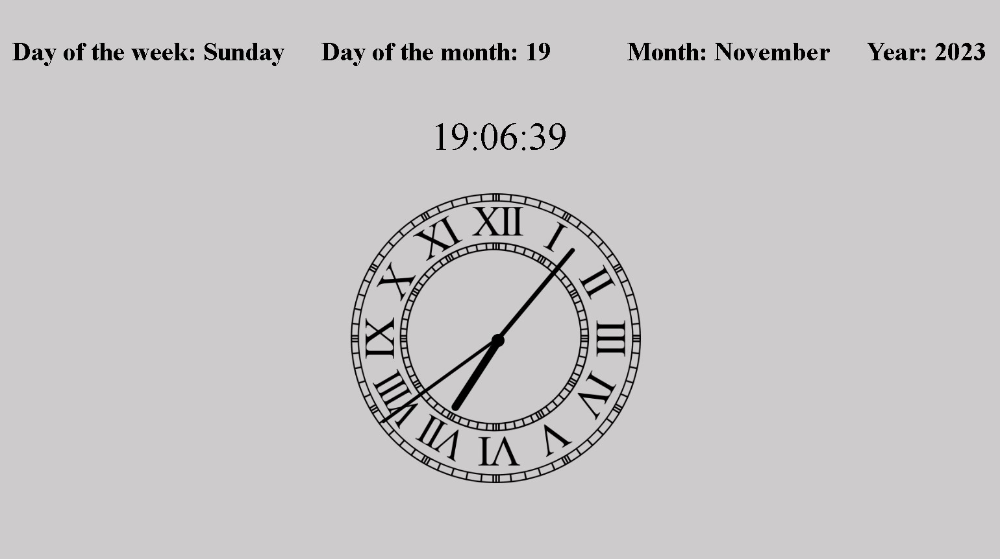

 
  
&#xa0;

<h1 align="center">Simple Clock</h1>

  

  

  

  

 

  <a href="#dart-about">About</a> &#xa0; | &#xa0; 
  <a href="#sparkles-features">Description</a> &#xa0; | &#xa0;
  <a href="#rocket-technologies">Technologies</a> &#xa0; 

 

## :dart: About

Task solution: create a simple clock according to the description.
<a href="https://maryna-korbet.github.io/simple-clock-js/">The result of the
task.</a> &#xa0;

 
  
&#xa0;

## :sparkles: Description

You need to create two clock examples (Electronic and Mechanical)

## :rocket: Technologies

The following tools were used in this project:

- [JavaScript](https://www.w3schools.com/js/)
- [HTML](https://www.w3schools.com/html/)
- [CSS](https://www.w3schools.com/css/)
